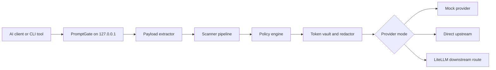

# PromptGate Blog Assets

## Architecture



## Egress Proof Summary

Synthetic sensitive inputs are sent to PromptGate. The upstream mock/fake provider receives scoped random placeholders such as `[PRIVATE_EMAIL_a3f9c1d2e4b56789]`, `[IP_ADDRESS_4b8e1a92cd3f7e60]`, and `[CODENAME_9a81fb320a5c4d77]`. Synthetic secrets are blocked locally.

## Coverage Matrix

| Surface | MVP status |
|---|---|
| API/CLI traffic routed through PromptGate | Covered |
| OpenAI-compatible chat completions | Covered |
| Anthropic-compatible messages | Covered |
| Nested tool outputs and JSON arguments | Covered |
| Browser ChatGPT | Not intercepted |
| SaaS IDE vendor backends | Not automatically covered |
| Agentic browser actions | Not covered |
| Real enterprise DLP vendors | Future adapter path only |

## Terminal Snippet Candidates

```bash
./scripts/release-check.sh
./scripts/test-egress.sh
./scripts/benchmark-local.py
curl -fsS http://127.0.0.1:8787/status
```
